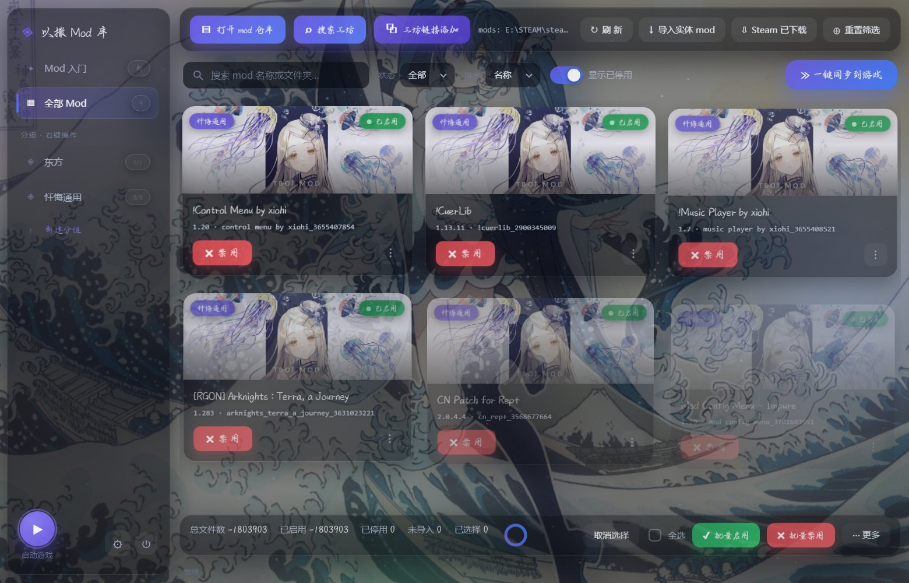
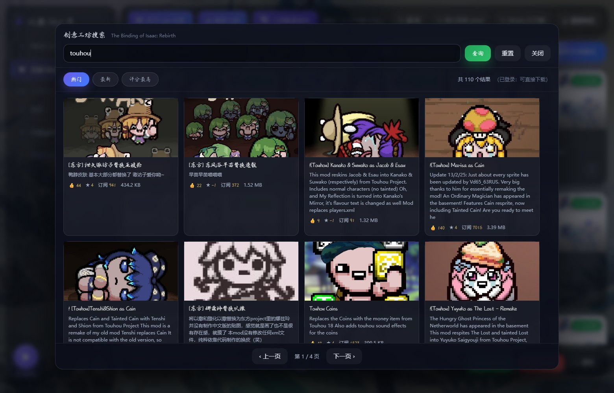
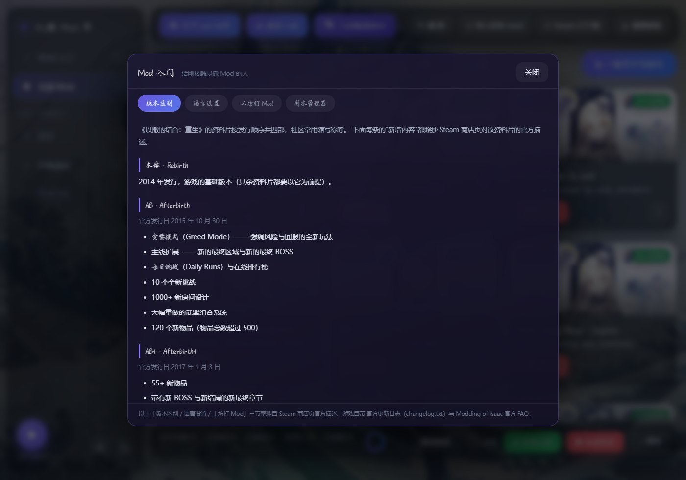
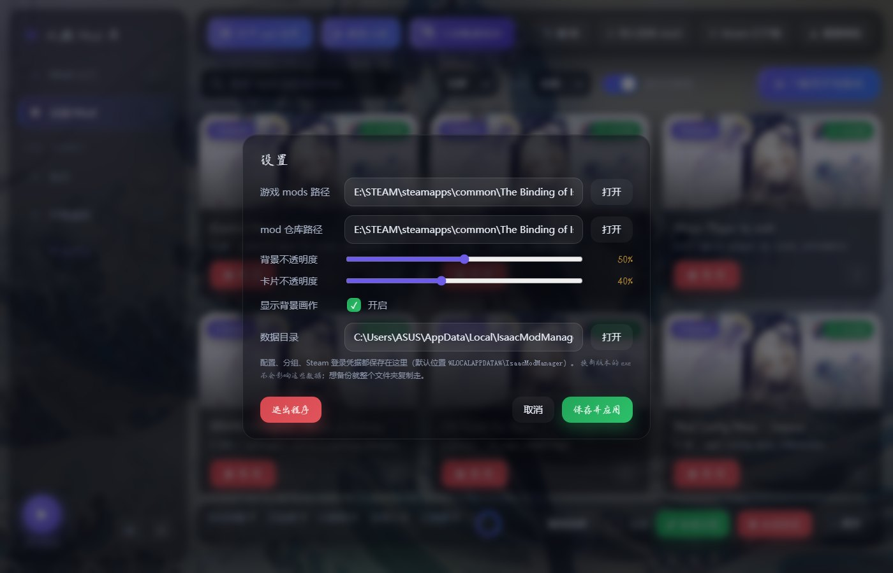

# 以撒的结合 · Mod 管理器

给《The Binding of Isaac: Rebirth》做的一个**本地 Mod 管理器**：把创意工坊的 mod 收进自己的
「仓库」，再用目录链接（junction）在游戏 `mods/` 里开关 —— 游戏目录始终干净，
想换组合就是点几下。

界面是一个本地网页（程序自己起服务 + 打开浏览器），所有数据都在本机。

---

## 功能

| 功能 | 说明 |
|---|---|
| **Mod 库管理** | 把 mod 从 `mods/` 收进仓库（默认 `游戏根目录/isaac_mod_library`），`mods/` 里只留一个目录链接。启用/停用 = 建/删链接，不搬文件 |
| **分组与排序** | 给 mod 分组、按组批量开关；分组顺序即加载顺序，可拖拽调整 |
| **创意工坊搜索** | 应用内按关键词搜创意工坊（热门 / 最新 / 评分最高），显示预览图、点赞、订阅数、大小 |
| **一键下载** | 详情页点「下载到我的仓库」→ 唤起 Steam 客户端 → 自动守候下载完成 → 自动导入并启用 |
| **导入已有 mod** | 三种来源都能收编：Steam 已下载的工坊内容 / 游戏展开出的实体文件夹 / 仓库里已有的 |
| **Mod 入门说明页** | 版本区别（AB / AB+ / 忏悔 / 忏悔+）、游戏内语言设置、创意工坊打 Mod、本工具用法，以及「忏悔+ 上用官方中文」的注入方案 |
| **界面个性化** | 背景画作、不透明度可调 |

---

## 界面预览



*主界面：左侧是分组与筛选，中间是 mod 卡片（一键启用/停用），顶栏是搜索、导入与工坊入口，左下角是启动游戏。*



*应用内搜索创意工坊：预览图、点赞、订阅数、大小一屏看完，点开就能下载。*



*内置的 Mod 入门说明页：版本区别 / 语言设置 / 工坊打 Mod / 本工具用法（内容都标注了来源）。*



*设置里能看到数据目录在哪 —— 配置与分组就存在那儿，换新版本的 exe 不会丢。*

---

## 快速开始

1. 到 [Releases](../../releases) 下载 **`IsaacModManager.exe`**（单文件，不自带任何东西也能跑），双击即可。
   - 想用便携版（文件夹形式、启动更快）就下 **`IsaacModManager-portable.zip`**，解压后运行里面的
     `IsaacModManager-portable.exe`。
2. 首次运行会自动尝试从注册表找到游戏的 `mods` 目录；找不到就在**设置**里手动填：
   `...\steamapps\common\The Binding of Isaac Rebirth\mods`
3. 开始用（下面「怎么打 Mod」）。

> **Windows SmartScreen 提示**：程序没有代码签名，首次运行可能弹「未知发布者」。点「更多信息 → 仍要运行」即可；
> 介意的话可以自己从源码构建（见下）。

---

## 数据放在哪（重要）

所有可写数据都在**用户数据目录**，**不在程序旁边**：

```
%LOCALAPPDATA%\IsaacModManager\
    config.json              配置与分组（你的 mod 分组就在这）
    steam_session.json       Steam 登录凭据（只有 token，不含密码）
    thumbs\                  工坊缩略图缓存
    isaac_mod_manager.log    运行日志
```

因此：

- **换新版本的 exe 不会丢分组** —— 直接覆盖旧文件即可（这也是把数据搬出程序目录的原因）。
- 想备份/搬机，把整个 `%LOCALAPPDATA%\IsaacModManager\` 复制走就行。
- 从旧版本（配置写在 exe 旁边）升级时，首次运行会自动把老配置与登录凭据搬过来一次。
- 想让数据跟着程序走（U 盘场景），用**便携模式**：在程序旁边放一个 `config.json`，或启动时加 `--portable`。

---

## 怎么打 Mod

### 方式 A：应用内搜索 + 一键下载（推荐）

1. 顶栏「⌕ 搜索工坊」→ 输入关键词（中文也行）→ 点开想要的 mod。
2. 点「↓ 下载到我的仓库」。
3. 程序会**唤起 Steam 客户端**打开该 mod 页面 —— 在 Steam 里点一下**「订阅」**。
4. 之后程序自动守候：下载完（目录大小连续几次不变）→ 自动复制进仓库 → 自动启用。
   > 也可以提前手动在 Steam 订阅，再回详情页点「导入已下载的」。

### 方式 B：收编已经下好的

| 情况 | 用哪个入口 |
|---|---|
| Steam 已订阅且**启动过游戏**（mod 已展开到 `mods/`） | 顶栏「↓ 导入实体 mod」（批量） |
| Steam 已下载但**没启动过游戏** | 顶栏「⇩ Steam 已下载」（列表里挑） |

装完记得在游戏里确认：**主菜单 → Mods** 里能看到并开启（改动后需重启游戏）。

### 为什么下载要经过 Steam 客户端？

以撒的创意工坊内容是**多文件 UGC**，Steam 只通过 depot 分发，**不提供直链** ——
所以任何第三方工具都无法"直接下载"（实测官方接口对以撒返回的 `file_url` 恒为空，
而 L4D2 这类单文件 UGC 才有直链）。

本工具的做法是：让**拥有游戏授权的 Steam 客户端**去下载，然后自动完成
"守候 → 导入仓库 → 建链接 → 启用"这一整串动作 —— 你只需要在 Steam 里点一次「订阅」。

---

## 从源码运行 / 自己打包

```powershell
# 直接跑（需要 Python 3.8+，只用标准库）
python isaac_mod_manager.py

# 打包：单文件 exe + 便携版，产物在 dist/
python build.py both
```

可选依赖（不加也能用）：

| 包 | 作用 |
|---|---|
| `Pillow` | 把工坊预览图（常是 1MB 的动图）压成小缩略图 |
| `cryptography` | 界面内登录 Steam 时做 RSA 加密（否则退回 pycryptodome） |

**命令行参数**

| 参数 | 说明 |
|---|---|
| `--port 8760` | 本地服务端口 |
| `--config <路径>` | 指定配置文件（覆盖默认位置） |
| `--portable` | 便携模式：配置写在程序旁边的 `config.json` |
| `--no-browser` | 不自动打开浏览器 |
| `--force-new` | 即使已有实例在跑也再起一个（默认复用已有实例） |

**自检**：`python tests/selftest.py`（约 240 项，含沙盒端到端）、`python tests/test_search.py`、
`python tests/test_datadir.py`

---

## 项目结构

```
isaac_mod_manager.py      主程序（HTTP 服务 + 界面后端 + Mod 库逻辑）
build.py                  PyInstaller 打包脚本
start_manager.bat         源码方式一键启动
web/                      前端（index.html / app.js / style.css）
assets/                   图标与背景图
tools/                    辅助脚本
    ws_search.py            创意工坊搜索（解析工坊页内嵌的 QueryFiles 数据）
    ws_login.py             界面内登录（现代网页认证 → token）
    steam_auth.py           Steam 认证流程封装
    ws_download.py          命令行下载器（单文件 UGC 用，如 L4D2）
    make_ca_bundle.py       合并系统根证书生成 CA 包（给命令行下载器用）
tests/                    自检与冒烟测试
```

---

## 说明页内容的来源

**Mod 入门**页面里的内容不是"凭印象写的"，都留了可核对的出处：

| 内容 | 来源 |
|---|---|
| 各版本（AB / AB+ / 忏悔 / 忏悔+）的定义与新增内容 | Steam 商店页官方描述（`store.steampowered.com/api/appdetails`） |
| 官方中文的引入版本与语言包 | 游戏自带 `changelog.txt`（v1.7.5 的 Localization 段落）+ `resources/packed/*.a` |
| 创意工坊打 Mod 的流程与前提 | Modding of Isaac 官方 FAQ + 游戏启动日志（`log.txt` 里的 `LOADED MOD` 记录） |
| 忏悔+ 的中文注入方案 | 补丁作者 README + 本地文件实证（`inject.bin` → `language_unlocker.dll` 字节数一致） |

页面底部也标注了来源。

---

## 许可

[MIT License](LICENSE) —— 可自由使用、修改、分发，保留版权声明即可。

---

## 免责声明

- 本工具**不包含**游戏本体、DLC 或任何游戏资源，也不绕过任何授权：下载仍然由你已授权的 Steam 客户端完成。
- 与 Valve、Edmund McMillen、Nicalis 均无关联；游戏名称与素材版权归各自权利人所有。
- 界面里的「忏悔+ 中文注入」说明指的是**第三方补丁**（会修改游戏主程序）。相关风险已在该页如实写明，
  是否使用请自行判断，并遵守游戏与 Steam 的服务条款。
- 本项目仅供学习与个人使用。
